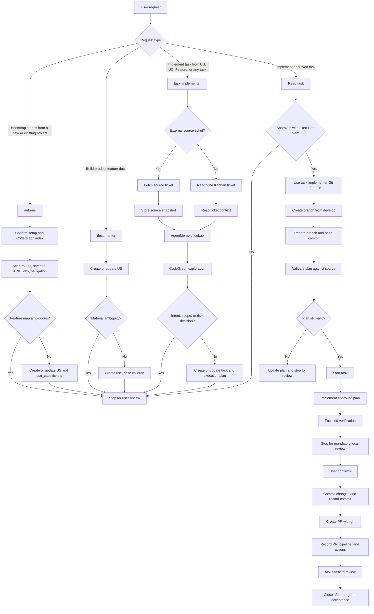

# AI Workspace for Software Projects

This is an AI workspace designed to build and manage software projects using an agentic workflow. The goal is to standardize idea generation, project analysis, task creation, implementation, review, and progress tracking in a VS Code + AI assistant environment.

## Overview

This workspace integrates the following core components:

- VS Code + AI agent
- Vibe Kanban for managing tickets, stories, use cases, tasks, and progress
- CodeGraph for understanding project structure and dependencies
- AgentMemory for storing project context and memory
- Auto-US project scanning for bootstrapping a new codebase into story/use-case tickets
- Analysis checkpoints that make the agent stop and ask when intent, scope, or risk needs a human decision
- Setup script to standardize the environment for a new project

It is suitable for scenarios such as:

- starting a new software project
- breaking work into use cases and tasks
- managing execution progress with AI
- creating a review/commit/PR workflow aligned with team standards

## Preconditions

Before working in this workspace, ensure the following conditions are enabled or set up:

1. VS Code
   - Enable Auto Tasks / auto-run tasks in VS Code if supported by the project
   - Reload VS Code after the first setup run

2. Git
   - Git is installed on the machine
   - The repository is in the correct workspace you intend to work on

3. Node.js / pnpm
   - Node.js and pnpm are installed to run Vibe Kanban and tools such as CodeGraph and AgentMemory

4. GitHub CLI (if PR creation is needed)
   - `gh` should be installed and authenticated if you need to push code or create a PR

5. AI workflow tools
   - CodeGraph
   - AgentMemory
   - Vibe Kanban

> Note: For the workflow of creating a new project, you must run the setup script before starting work on the actual code.

## Quick Setup

Run the following command from the workspace root:

```bash
chmod +x scripts/setup.sh
./scripts/setup.sh
```

This script will:

- create the configuration folders for AI agents
- initialize the Vibe Kanban database
- check/install CodeGraph
- configure CodeGraph for Claude Code and Codex
- initialize the project index
- check/install AgentMemory
- connect AgentMemory for the relevant environments
- link skill/rules into the workspace
- remind you to reload VS Code so the agents are initialized correctly

After running it, reload VS Code to ensure the agents, tasks, and rules are recognized.

## Workflow

The workspace separates product definition from implementation. Vibe Kanban is the
control plane, while CodeGraph and AgentMemory provide codebase and project context.
During analysis and planning, the agent should proceed only when the intent is
clear enough to document or plan. If analysis reveals materially different
interpretations, ticket hierarchies, implementation slices, UX behaviors, data
contracts, integrations, or risk profiles, the agent stops and asks the user
before creating/changing tickets or coding. Minor local assumptions that do not
change product meaning or implementation risk can be recorded in Vibe Kanban and
the work can continue.



### New project sequence

1. Check prerequisites: VS Code auto tasks, Git, Node.js, pnpm, and required tools.
2. Run `./scripts/setup.sh` from the workspace root.
3. Create the project under `source/` or in a separate workspace.
4. Before analysis or implementation, look for and follow `PROJECTS.md` when it exists in the repository or applicable project directory.
5. If the project already has code, explicitly run the `auto-us` workflow to scan routes, screens, APIs, jobs, navigation, and permission surfaces with CodeGraph, then create or update Vibe Kanban `US -> use_case[]` tickets from the discovered feature clusters.
6. If the project starts from product notes instead of existing code, use `documenter` to create the initial `US -> use_case[]` tree directly from those requirements.
7. For UI-heavy projects, use `design-collector` to extract or refresh `DESIGN.md` before implementation tasks are planned.
8. Preserve relevant context with AgentMemory and keep Vibe Kanban as the source of truth.
9. Stop and ask for user direction when analysis exposes competing intents, unclear scope, ambiguous hierarchy, or materially different implementation risks.
10. When implementation is requested, use `task-implementer` to scan the current codebase and create approval-ready `task` tickets with execution plans.
11. Implement only approved task execution plans under `source/**`, except for explicitly approved workspace-level supporting changes.
12. Run focused verification, stop for mandatory local user review, then commit only after confirmation.
13. Push the branch and create a PR with GitHub CLI when required.

## Workspace Structure

```text
.
├── AGENTS.md                 # AI agent workflow and rules
├── DESIGN.md                 # Design rules / UI direction
├── README.md                 # Workspace documentation
├── scripts/
│   └── setup.sh             # AI workspace environment setup
├── source/                  # Project source files
├── .agents/                 # Canonical shared agent skills and rules
├── .codex/                  # Codex configuration and skills
├── .claude/                 # Claude Code configuration and skills
├── .vibe-kanban/            # Task and progress database
└── .codegraph/              # Code analysis index and related data
```

## Working Rules

- Use Vibe Kanban as the control plane for stories, tasks, and progress.
- For a new project with existing code, use `auto-us` only when explicitly asked to bootstrap or infer stories from the codebase.
- Use `documenter` for user-provided product requirements; use `auto-us` for codebase-derived feature maps; use `task-implementer` only when implementation is requested.
- Do not start coding before the task or execution plan is approved.
- Stop and ask during analysis when multiple intents, hierarchy choices, UX/data/integration decisions, or risk profiles would lead to different tickets or implementation plans.
- When creating a new project, always run setup first.
- Use CodeGraph to understand the project architecture instead of guessing.
- Use AgentMemory to preserve context and reusable rules.
- Keep task scope clear and validate/review before merging.

## Local Skills

Canonical skills live in `.agents/skills/`. The setup script links them into
`.codex/skills/` and `.claude/skills/` so each agent can discover the same
workflow. Use the canonical path when running project-local tools directly, for
example:

```bash
node .agents/skills/vibe-kanban/scripts/vibe-kanban.mjs <command>
```

Useful discovery commands:

```bash
node .agents/skills/vibe-kanban/scripts/vibe-kanban.mjs smart-search "<query>" --parent-for task --json
node .agents/skills/vibe-kanban/scripts/vibe-kanban.mjs detect-kind "<task request>" --json
node .agents/skills/vibe-kanban/scripts/vibe-kanban.mjs activity --limit 50 --json
```

Use `smart-search` when an agent needs related Vibe Kanban context, such as finding a likely parent before linking or implementing a task. Its output includes the detected task kind (`feature`, `bugfix`, `refactor`, `chore`, `docs`, `test`) and a parent suggestion with confidence; the agent confirms both with the developer before creating a free-form task. Tickets can be removed with `delete <ticket-id> [--cascade]`; the activity log keeps a `ticket.deleted` audit entry.

Pending approval and blocked-question commands:

```bash
node .agents/skills/vibe-kanban/scripts/vibe-kanban.mjs comment <task-ticket-id> --comment "<user feedback>" --actor user --quiet
node .agents/skills/vibe-kanban/scripts/vibe-kanban.mjs questions <ticket-id> --questions "<markdown questions>" --description "Blocked pending user clarification" --quiet
```

User comments let reviewers give feedback before approving a task. Open questions move the ticket to `hold` so unresolved decisions stay visible until a human answers them. If the agent has an available Teams, Slack, email, or other human-notification skill/tool, it should trigger that after recording the open questions; otherwise the current chat is the fallback channel.

### Skill coordination

Use the skills as one workflow, not as interchangeable shortcuts:

| Situation                                                                                                         | Skill                                             | Output                                                                       |
| ----------------------------------------------------------------------------------------------------------------- | ------------------------------------------------- | ---------------------------------------------------------------------------- |
| New project has existing code and the user asks to bootstrap/infer stories                                        | `auto-us`                                         | CodeGraph-derived `US -> use_case[]` tickets                                 |
| User gives product notes, requirements, scenarios, or acceptance criteria                                         | `documenter`                                      | Human-authored `US -> use_case[]`, feedback groups, or documentation updates |
| User asks to implement a `US`, `use_case`, feedback group, source ticket, or approved task                        | `task-implementer`                                | Approval-ready `task` tickets or approved-code implementation                |
| Work needs ticket storage, approval state, progress, branch, commits, PRs, pipelines, comments, or open questions | `vibe-kanban`                                     | Durable workflow trace in SQLite                                             |
| Implementation needs branch, commit, PR, or review discipline                                                     | `task-implementer` + `references/git-workflow.md` | Scoped branch, mandatory local review before commit, and PR trace            |
| UI implementation changes screens/components                                                                      | `react-ui-implementer`                            | UI work aligned to `DESIGN.md` and existing component patterns               |
| UI work creates or extracts reusable React components                                                             | `react-reusable-component-builder`                | Typed reusable components with clear ownership                               |
| A project needs its existing visual system captured                                                               | `design-collector`                                | `DESIGN.md` design contract                                                  |

The handoff order for a new project with code is: setup, optional `design-collector` for UI projects, explicit `auto-us`, user review, `task-implementer` task planning, user approval, implementation, mandatory local review, commit, PR/review.

## Goal of the Workspace

This workspace serves as an AI-driven software development foundation to help you:

- start new projects quickly
- manage progress clearly
- reduce errors caused by missing context
- optimize the workflow from planning to implementation and review

## Getting Started

If you are preparing to build a new project, follow these steps:

```bash
cd /path/to/ai-workspace
./scripts/setup.sh
```

Then open VS Code or reload current windows, enable auto tasks, and begin creating stories/tasks for your project.

## Notes

This workspace is a template/foundation for AI-assisted software development. Depending on the project, you can extend it with additional rules, skills, task flows, or repository-specific configuration.
