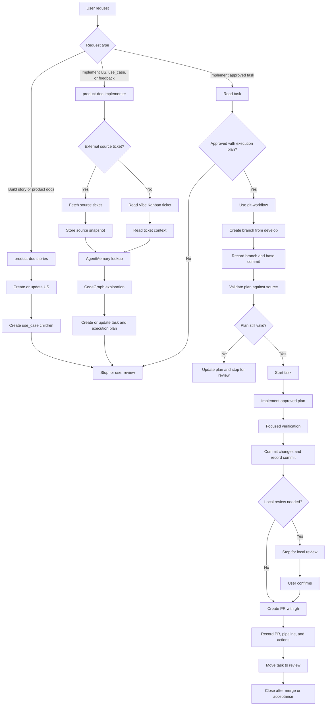

# AI Workspace for Software Projects

This is an AI workspace designed to build and manage software projects using an agentic workflow. The goal is to standardize idea generation, project analysis, task creation, implementation, review, and progress tracking in a VS Code + AI assistant environment.

## Overview

This workspace integrates the following core components:

- VS Code + AI agent
- Vibe Kanban for managing tickets, stories, use cases, tasks, and progress
- CodeGraph for understanding project structure and dependencies
- AgentMemory for storing project context and memory
- Setup script to standardize the environment for a new project

It is suitable for scenarios such as:

- starting a new software project
- breaking work into use cases and tasks
- managing execution progress with AI
- creating a review/commit/PR workflow aligned with team standards

## Preconditions

Before working in this workspace, ensure the following conditions are enabled or set up:

1. VS Code
   - Enable Auto Tasks / auto-run tasks in VS Code if supported by the project
   - Reload VS Code after the first setup run

2. Git
   - Git is installed on the machine
   - The repository is in the correct workspace you intend to work on

3. Node.js / pnpm
   - Node.js and pnpm are installed to run Vibe Kanban and tools such as CodeGraph and AgentMemory

4. GitHub CLI (if PR creation is needed)
   - `gh` should be installed and authenticated if you need to push code or create a PR

5. AI workflow tools
   - CodeGraph
   - AgentMemory
   - Vibe Kanban

> Note: For the workflow of creating a new project, you must run the setup script before starting work on the actual code.

## Quick Setup

Run the following command from the workspace root:

```bash
chmod +x scripts/setup.sh
./scripts/setup.sh
```

This script will:

- create the configuration folders for AI agents
- initialize the Vibe Kanban database
- check/install CodeGraph
- configure CodeGraph for Claude Code and Codex
- initialize the project index
- check/install AgentMemory
- connect AgentMemory for the relevant environments
- link skill/rules into the workspace
- remind you to reload VS Code so the agents are initialized correctly

After running it, reload VS Code to ensure the agents, tasks, and rules are recognized.

## Workflow

The workspace separates product definition from implementation. Vibe Kanban is the
control plane, while CodeGraph and AgentMemory provide codebase and project context.



### New project sequence

1. Check prerequisites: VS Code auto tasks, Git, Node.js, pnpm, and required tools.
2. Run `./scripts/setup.sh` from the workspace root.
3. Create the project under `source/` or in a separate workspace.
4. Define stories and use cases in Vibe Kanban before coding.
5. Analyze the codebase with CodeGraph and preserve context with AgentMemory.
6. Implement only approved task execution plans.
7. Run focused verification, review the diff, and commit scoped changes.
8. Push the branch and create a PR with GitHub CLI when required.

## Workspace Structure

```text
.
├── AGENTS.md                 # AI agent workflow and rules
├── DESIGN.md                 # Design rules / UI direction
├── README.md                 # Workspace documentation
├── scripts/
│   └── setup.sh             # AI workspace environment setup
├── source/                  # Project source files
├── .codex/                  # Codex configuration and skills
├── .claude/                 # Claude Code configuration and skills
├── .vibe-kanban/            # Task and progress database
└── .codegraph/              # Code analysis index and related data
```

## Working Rules

- Use Vibe Kanban as the control plane for stories, tasks, and progress.
- Do not start coding before the task or execution plan is approved.
- When creating a new project, always run setup first.
- Use CodeGraph to understand the project architecture instead of guessing.
- Use AgentMemory to preserve context and reusable rules.
- Keep task scope clear and validate/review before merging.

## Goal of the Workspace

This workspace serves as an AI-driven software development foundation to help you:

- start new projects quickly
- manage progress clearly
- reduce errors caused by missing context
- optimize the workflow from planning to implementation and review

## Getting Started

If you are preparing to build a new project, follow these steps:

```bash
cd /path/to/ai-workspace
./scripts/setup.sh
```

Then open VS Code or reload current windows, enable auto tasks, and begin creating stories/tasks for your project.

## Notes

This workspace is a template/foundation for AI-assisted software development. Depending on the project, you can extend it with additional rules, skills, task flows, or repository-specific configuration.
